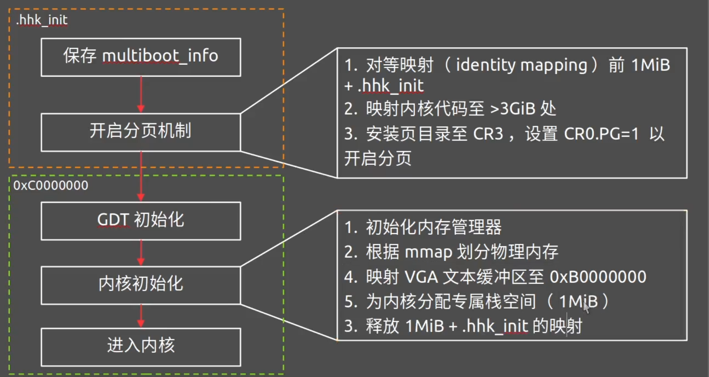
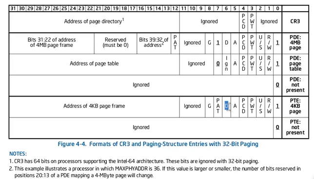

分页机制开启流程

1.链接器：
为了开启分页，我们需要将代码划分为两部分，第一开启分页之前的代码，这部分代码需要放在物理地址1MB处，只需. = 0x100000;即可，
第二部分代码是开启分页之后的代码，这部分代码需要放在虚拟地址3GB处，但物理地址仍为1MB，这里需要解决一个问题：链接器解析的函数或全局变量的地址必须是3GB，而代码又需要放到1MB，故使用以下代码
    . += 0xC0000000;
    .text BLOCK(4K) : AT ( ADDR(.text) - 0xC0000000 ) {
        __kernel_start = .;
        build/obj/kernel/*.o (.text)
    }
因此，我们需要把目录拆分开，kernel运行分页之后的代码，hhk运行分页前的代码。

2.流程

